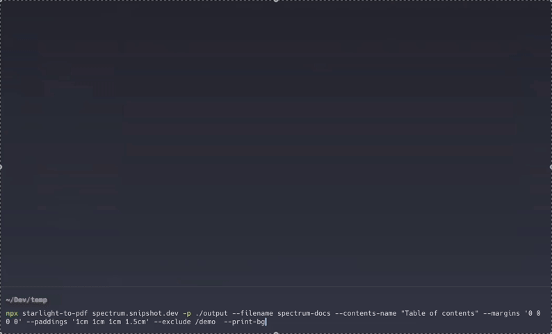

# starlight-to-pdf

[](https://www.npmjs.com/package/starlight-to-pdf?activeTab=versions)
[](https://www.npmjs.com/package/starlight-to-pdf?activeTab=readme)
[](https://github.com/Linkerin/starlight-to-pdf/blob/main/LICENSE)
[](https://github.com/Linkerin/starlight-to-pdf/stargazers)


## 📖 Description <a id="description"></a>

A command-line tool for converting documentation websites built with
🌟[Starlight](https://starlight.astro.build) into PDF files.

> Feel free to open an
> [issue](https://github.com/Linkerin/starlight-to-pdf/issues) if you have any
> questions or suggestions. We would also appreciate any contributions.

## ⌨️ Example usage <a id="usage"></a>

Get started quickly with a single command:

```bash
npx starlight-to-pdf https://starlight.astro.build
```

> Note: Ensure you have [Node.js](https://nodejs.org) (v16 or higher) installed
> on your machine.

URL is the only positional and required argument. You can also provide a URL
using the `--url` (or `-u`) flag.

## 👨‍💻 CLI Flags Reference <a id="flags"></a>

| Flag              | Short | Type      | Description                                                                                                                                                                                                                   |
| ----------------- | ----- | --------- | ----------------------------------------------------------------------------------------------------------------------------------------------------------------------------------------------------------------------------- |
| `--url`           | `-u`  | `string`  | The URL of the Starlight powered documentation website to convert to PDF. The only positional argument can be used instead of this flag. See [👨‍💻 Example usage](#usage) for more details.                                     |
| `--contents-name` |       | `string`  | The name used for the generated table of contents in the PDF. By default, it's `"Contents"`                                                                                                                                   |
| `--exclude`       | `-e`  | `string`  | A string containing links separated by `space` that shouldn't be added to the resulting PDF file (e.g. `--exclude '/docs/contacts /docs/demo'`). You may also provide multiple values: `-e /docs/contacts -e /docs/demo`.     |
| `--filename`      | `-f`  | `string`  | The output filename for the generated PDF. Default is the [hostname](https://developer.mozilla.org/en-US/docs/Web/API/URL/hostname) of the provided website.                                                                  |
| `--format`        |       | `string`  | The paper format (e.g., `A4`, `Letter`) for the generated PDF. Check [Puppeteer's paper formats](https://pptr.dev/api/puppeteer.paperformat) for more details                                                                 |
| `--help`          | `-h`  | `boolean` | Displays the help message and exits.                                                                                                                                                                                          |
| `--last`          | `-l`  | `string`  | A string of the last link that will be parsed (e.g. `--last /docs/demo`). If the last page is reached, the program will stop parsing and will generate output PDF.                                                            |
| `--margins`       |       | `string`  | Sets margins for the PDF file. They must be provided as a string with 4 values separates by `space`, reflecting the top, right, bottom and left margins respectively. Default value is `'1cm 1cm 1cm 1.5cm'`.                 |
| `--no-contents`   |       | `boolean` | Disables the table of contents in the generated PDF.                                                                                                                                                                          |
| `--paddings`      |       | `string`  | Sets padding for the PDF content. They must be provided as a string with 4 values separates by `space`, reflecting the top, right, bottom and left paddings respectively. Paddings are disabled by default.                   |
| `--path`          | `-p`  | `string`  | The directory path where the PDF will be saved. Default value is the current working directory.                                                                                                                               |
| `--pdf-outline`   |       | `boolean` | Generates an outline for the PDF file on the side. It's an `outline` property in [Puppeteer's PDFOptions](https://pptr.dev/api/puppeteer.pdfoptions).                                                                         |
| `--print-bg`      |       | `boolean` | Set to print background graphics. It's a `printBackground` property in [Puppeteer's PDFOptions](https://pptr.dev/api/puppeteer.pdfoptions/).                                                                                  |
| `--styles`        |       | `string`  | Path to the CSS file containing custom styles for the generated PDF. The styles will be injected into the `<style>` tag inside the `<body>` element. Also check the list of [special CSS classes](#classes) used by the tool. |
| `--timeout`       |       | `string`  | Timeout for both the page actions and `protocolTimeout` in milliseconds. You may need to increase this value for parsing large websites. The default value is `180_000` (2 minutes).                                          |
| `--version`       | `-v`  | `boolean` | Displays the version of the tool and exits.                                                                                                                                                                                   |

### Usage example:

```bash
npx starlight-to-pdf spectrum.snipshot.dev -p ./output --filename spectrum-docs --contents-name "Table of contents" --margins '0 0 0 0' --paddings '1cm 1cm 1cm 1.5cm' --exclude /demo  --print-bg
```

Resulting PDF file: [spectrum-docs.pdf](./readme_assets/spectrum-docs.pdf)

### Special CSS classes <a id="classes"></a>

- `.s2pdf-container` - The wrapper around all the website parsed content
  _(excluding the table of contents)_.
- `.s2pdf-contents` - The `<ul>` element containing the generated table of
  contents.
- `.s2pdf-heading` - The element that contains `<h1>` headings of each page.
- `.s2pdf-pagebreak` - Each page text content with a defined CSS
  `break-after: page` property.

### Demo



## 📨 Contacts <a id="contacts"></a>

If you want to get in touch, you may open a
[GitHub issue](https://github.com/Linkerin/starlight-to-pdf/issues) or send me
an email at: [gusev@snipshot.dev](mailto:gusev@snipshot.dev).

## 🪪 License <a id="license"></a>

**starlight-to-pdf** is licensed under the MIT License. See the
[LICENSE](https://github.com/Linkerin/starlight-to-pdf/blob/main/LICENSE) file
for details.
