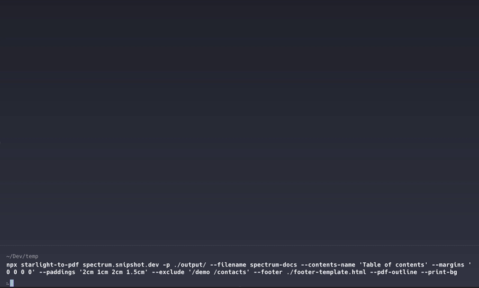

# starlight-to-pdf

[](https://www.npmjs.com/package/starlight-to-pdf?activeTab=versions)
[](https://www.npmjs.com/package/starlight-to-pdf?activeTab=readme)
[](https://github.com/Linkerin/starlight-to-pdf/blob/main/LICENSE)
[](https://github.com/Linkerin/starlight-to-pdf/stargazers)

[](#)

- [Description](#description)
- [⌨️ Getting started](#start)
- [👨‍💻 CLI Flags Reference](#flags)
  - [Usage example](#usage)
  - [Special CSS classes](#classes)
  - [PDF header and footer](#header-footer)
  - [Demo](#demo)
- [📨 Contacts](#contacts)
- [🪪 License](#license)

## 📖 Description <a id="description"></a>

A command-line tool for converting documentation websites built with
🌟[Starlight](https://starlight.astro.build) into PDF files.

> Have questions or suggestions? Feel free to open an
> [issue](https://github.com/Linkerin/starlight-to-pdf/issues). Contributions
> are always welcome!

## ⌨️ Getting started <a id="start"></a>

Convert your Starlight documentation into a PDF file with a single command:

```bash
npx starlight-to-pdf https://starlight.astro.build
```

> Note: Ensure you have [Node.js](https://nodejs.org) (v18 or higher) and Chrome
> browser installed on your machine.

URL is the only positional and required argument. Alternatively, you can use the
`--url` (or `-u`) flag to specify it.

## 👨‍💻 CLI Flags Reference <a id="flags"></a>

| Flag              | Short | Type      | Description                                                                                                                                                                                                                                                                                                                                                                                                                                                                      |
| ----------------- | ----- | --------- | -------------------------------------------------------------------------------------------------------------------------------------------------------------------------------------------------------------------------------------------------------------------------------------------------------------------------------------------------------------------------------------------------------------------------------------------------------------------------------- |
| `--url`           | `-u`  | `string`  | The URL of the Starlight powered documentation website to convert to PDF. The only positional argument can be used instead of this flag. See [⌨️ Getting started](#start) for details.                                                                                                                                                                                                                                                                                           |
| `--contents-name` |       | `string`  | Customizes the generated table of contents name in the PDF. Default: `"Contents"`                                                                                                                                                                                                                                                                                                                                                                                                |
| `--css-page-size` |       | `boolean` | Allows setting the PDF page size using CSS `@page`. If the predefined sizes in the `--format` option don't meet your needs, enable this option and specify the desired page size in custom CSS provided via the `--styles` flag (e.g., `@page { size: 8.5in 14in; }`). Note: if you define a page size in CSS without enabling this option, the size from the `--format` option will be used instead, and the content will be scaled to fit the dimensions specified in `@page`. |
| `--exclude`       | `-e`  | `string`  | A string containing links separated by `space` that shouldn't be added to the resulting PDF file (e.g. `--exclude '/docs/contacts /docs/demo'`). You may also provide multiple values: `-e /docs/contacts -e /docs/demo`.                                                                                                                                                                                                                                                        |
| `--filename`      | `-f`  | `string`  | The output filename for the PDF. Default is the [hostname](https://developer.mozilla.org/en-US/docs/Web/API/URL/hostname) of the provided URL.                                                                                                                                                                                                                                                                                                                                   |
| `--footer`        |       | `string`  | Path to the HTML file for the PDF print footer. For more details, check [PDF header and footer](#header-footer) section and [Puppeteer's PDFOptions](https://pptr.dev/api/puppeteer.pdfoptions#headertemplate).                                                                                                                                                                                                                                                                  |
| `--format`        |       | `string`  | The paper format (e.g., `A4`, `Letter`) for the PDF file. Refer to [Puppeteer's paper formats](https://pptr.dev/api/puppeteer.paperformat) for more details                                                                                                                                                                                                                                                                                                                      |
| `--header`        |       | `string`  | Path to the HTML file that will be used as a print header for the generated PDF. For more details, check [PDF header and footer](#header-footer) section and [Puppeteer's PDFOptions](https://pptr.dev/api/puppeteer.pdfoptions#headertemplate).                                                                                                                                                                                                                                 |
| `--help`          | `-h`  | `boolean` | Displays the help message and exits.                                                                                                                                                                                                                                                                                                                                                                                                                                             |
| `--last`          | `-l`  | `string`  | Sets the last link to parse (e.g. `--last /docs/demo`). Further parsing stops once this link is reached and parsed.                                                                                                                                                                                                                                                                                                                                                              |
| `--margins`       |       | `string`  | Sets margins for the PDF file. Provide a string with 4 values separated by `space`, reflecting the top, right, bottom and left margins respectively. Default value is `'1cm 1cm 1cm 1.5cm'`.                                                                                                                                                                                                                                                                                     |
| `--no-contents`   |       | `boolean` | Disables generation of the table of contents in the PDF.                                                                                                                                                                                                                                                                                                                                                                                                                         |
| `--paddings`      |       | `string`  | Sets padding for the PDF content. Provide a string with 4 values separated by `space`, reflecting the top, right, bottom and left paddings respectively. Paddings are disabled by default.                                                                                                                                                                                                                                                                                       |
| `--path`          | `-p`  | `string`  | Sets the directory path for the output PDF. Default is the current working directory.                                                                                                                                                                                                                                                                                                                                                                                            |
| `--pdf-outline`   |       | `boolean` | Enables a side outline in the PDF file. It's an `outline` property in [Puppeteer's PDFOptions](https://pptr.dev/api/puppeteer.pdfoptions).                                                                                                                                                                                                                                                                                                                                       |
| `--print-bg`      |       | `boolean` | Enables printing of background graphics. It's a `printBackground` property in [Puppeteer's PDFOptions](https://pptr.dev/api/puppeteer.pdfoptions/).                                                                                                                                                                                                                                                                                                                              |
| `--styles`        |       | `string`  | Path to a CSS file for custom PDF styles. The styles are injected into the `<style>` tag inside the `<body>` element. Also check the list of [special CSS classes](#classes) used by the tool.                                                                                                                                                                                                                                                                                   |
| `--timeout`       |       | `string`  | Timeout for both the page actions and `protocolTimeout` in milliseconds. You may need to increase this value for parsing large websites. The default value is `180_000` (2 minutes).                                                                                                                                                                                                                                                                                             |
| `--version`       | `-v`  | `boolean` | Displays the tool version and exits.                                                                                                                                                                                                                                                                                                                                                                                                                                             |

### Usage example <a id="usage"></a>

```bash
npx starlight-to-pdf spectrum.snipshot.dev -p ./output --filename spectrum-docs --contents-name "Table of contents" --margins '0 0 0 0' --paddings '2cm 1cm 2cm 1.5cm' --exclude '/demo /contacts' --header ./readme_assets/header-template.html --footer ./readme_assets/footer-template.html --print-bg --pdf-outline
```

Resulting PDF file: [spectrum-docs.pdf](./readme_assets/spectrum-docs.pdf)

### Special CSS classes <a id="classes"></a>

- `.s2pdf-container` - The wrapper around all the website parsed content
  _(excluding the table of contents)_.
- `.s2pdf-contents` - The `<ul>` element containing the generated table of
  contents.
- `.s2pdf-heading` - The element that contains `<h1>` headings of each page.
- `.s2pdf-pagebreak` - Each page text content with a defined CSS
  `break-after: page` property.

### PDF header and footer <a id="header-footer"></a>

You can provide an HTML template for the print header and footer of the
generated PDF file. Inside the templates you may also include HTML elements with
the following classes and values will be automatically injected into them:

- `.date` - formatted print date;
- `.pageNumber` - current page number;
- `.totalPages` - total number of pages in the document.

> Note that Puppeteer's template classes `.title` and `.url` are useless for the
> tool, as the PDF file is generated on one web page and these values will be
> the same on all document pages. However, you may still use them in your
> template, if necessary.

Some things to keep in mind:

- The template must be a valid HTML structure.
- You should define `font-size` property as Puppeteer's default value is `0`.
- Use inline `<style>` tag to define your styles. Website styles are **not
  available** inside the templates.
- Images should be encoded as base64 strings.
- Use `--margins` and `--paddings` options to achieve the desired layout.

Check [header-template.html](./readme_assets/header-template.html) and
[footer-template.html](./readme_assets/footer-template.html) as valid
examples.  
You may also check [the resulting PDF file](./readme_assets/spectrum-docs.pdf).

### Demo <a id="demo"></a>



## 📨 Contacts <a id="contacts"></a>

If you want to get in touch, you may open a
[GitHub issue](https://github.com/Linkerin/starlight-to-pdf/issues) or email me
at: [gusev@snipshot.dev](mailto:gusev@snipshot.dev).

## 🪪 License <a id="license"></a>

**starlight-to-pdf** is licensed under the MIT License. See the
[LICENSE](https://github.com/Linkerin/starlight-to-pdf/blob/main/LICENSE) file
for details.
